# Programmentwurf Monopoly

_Allgemeine Anmerkungen:_

- _es darf nicht auf andere Kapitel als Leistungsnachweis verwiesen werden (z.B. in der Form “XY wurde schon in Kapitel 2 behandelt, daher hier keine Ausführung”)_
- _alles muss in UTF-8 codiert sein (Text und Code)_
- _sollten mündliche Aussagen den schriftlichen Aufgaben widersprechen, gelten die schriftlichen Aufgaben (ggf. an Anpassung der schriftlichen Aufgaben erinnern!)_
- _alles muss ins Repository (Code, Ausarbeitung und alles was damit zusammenhängt)_
- _die Beispiele sollten wenn möglich vom aktuellen Stand genommen werden_
  - _finden sich dort keine entsprechenden Beispiele, dürfen auch ältere Commits unter Verweis auf den Commit verwendet werden_
  - _Ausnahme: beim Kapitel “Refactoring” darf von vorne herein aus allen Ständen frei gewählt werden (mit Verweis auf den entsprechenden Commit)_
- _falls verlangte Negativ-Beispiele nicht vorhanden sind, müssen entsprechend mehr Positiv-Beispiele gebracht werden_
  - _Achtung: werden im Code entsprechende Negativ-Beispiele gefunden, gibt es keine Punkte für die zusätzlichen Positiv-Beispiele_
  - _Beispiele_
    - _“Nennen Sie jeweils eine Klasse, die das SRP einhält bzw. verletzt.”_
      - _Antwort: Es gibt keine Klasse, die SRP verletzt, daher hier 2 Klassen, die SRP einhalten: [Klasse 1], [Klasse 2]_
      - _Bewertung: falls im Code tatsächlich keine Klasse das SRP verletzt: volle Punktzahl ODER falls im Code mind. eine Klasse SRP verletzt: halbe Punktzahl_
- _verlangte Positiv-Beispiele müssen gebracht werden_
- _Code-Beispiel = Code in das Dokument kopieren_

## Kapitel 1: Einführung

### Übersicht über die Applikation

_[Was macht die Applikation? Wie funktioniert sie? Welches Problem löst sie/welchen Zweck hat sie?]_

Ziel der Anwendung ist es, das Brettspiel Monopoly digital nachzubilden. Dabei spielen alle Spieler nacheinander der Reihenfolge nach am gleichen Rechner. Die Interaktion mit dem Spiel läuft über die Konsole.

### Wie startet man die Applikation?

_[Wie startet man die Applikation? Welche Voraussetzungen werden benötigt? Schritt-für-Schritt-Anleitung]_

Voraussetzungen:

- Java 17
- Maven

Anwendung bauen:

```shell
mvn package
```

Spiel starten:

```shell
java -jar monopoly.jar
```

### Wie testet man die Applikation?

_[Wie testet man die Applikation? Welche Voraussetzungen werden benötigt? Schritt-für-Schritt-Anleitung]_

```shell
mvn test
```

## Kapitel 2: Clean Architecture

### Was ist Clean Architecture?

_[allgemeine Beschreibung der Clean Architecture in eigenen Worten]_

Eine Software, die nach dem Konzept Clean Architecture entwickelt ist, wird in mehrere Schichten unterteilt. Das Kernkonzept besteht darin, dass die äußeren Schichten von den weiter innen liegenden abhängen, nicht aber andersherum. Dadurch lässt sich eine Komponente in einer äußeren Schicht austauschen, ohne dass weiter innen liegende Schichten an diese Änderung angepasst werden müssen. Die optionale innerste Schicht Abstraction enthält domänenübergreifenden Code. Die nächstäußere Schicht Domain implementiert die zentrale Geschäftslogik innerhalb der Domäne. Die Application Schicht enthält die für unterschiedliche Anwendungsfälle spezifische Logik. Die Adapter Schicht dient zur Entkopplung zwischen der Application Schicht und der äußersten Schicht. Die Plugins Schicht ist die äußerste Schicht und enthält die Bestandteile, die am häufigsten ausgetauscht werden. Dazu gehören Frameworks und Bibliotheken für z.B. Benutzerschnittstellen oder Datenspeicherung.

### Analyse der Dependency Rule

_[(1 Klasse, die die Dependency Rule einhält und eine Klasse, die die Dependency Rule verletzt);   jeweils UML der Klasse und Analyse der Abhängigkeiten in beide Richtungen (d.h., von wem hängt die Klasse ab und wer hängt von der Klasse ab) in Bezug auf die Dependency Rule]_

Die Dependency Rule besagt, dass Code in einer Schicht nur von der eigenen Schicht und weiter innen liegenden Schichten abhängen darf, aber nicht von weiter außen liegenden Schichten. Das Projekt ist in drei Submodules für die drei Schichten unterteilt. Die Maven-Konfiguration stellt sicher, dass nur Abhängigkeiten von außen nach innen möglich sind. Daher gibt es hier keine Negativ-Beispiele und es folgen zwei Positiv-Beispiele.

#### Positiv-Beispiel 1

Im ersten Beispiel wird das Umfeld der Klasse `GameStateService` betrachtet. Von ihr hängt nur die Klasse `ConsoleUI` ab, die in einer Schicht weiter außen liegt. Sie hängt von den Interfaces `PlayerRepository` und `SpaceRepository` ab, welche in einer Schicht weiter innen liegen. Diese werden zwar von einer Schicht weiter außen implementiert, diese konkreten Implementierungen sind der Klasse `GameStateService` jedoch nicht bekannt.

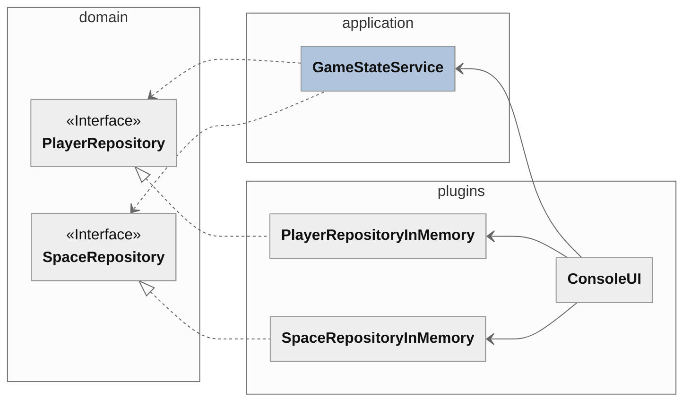
```mermaid
---
config:
  theme: neutral
  class:
    hideEmptyMembersBox: true
---
classDiagram
direction LR

namespace domain {
	class PlayerRepository { <<Interface>> }
	class SpaceRepository { <<Interface>> }
}
namespace application {
	class GameStateService
}
namespace plugins {
	class ConsoleUI
	class PlayerRepositoryInMemory
	class SpaceRepositoryInMemory
}
PlayerRepository <.. GameStateService
SpaceRepository <.. GameStateService
GameStateService <-- ConsoleUI
PlayerRepositoryInMemory <-- ConsoleUI
SpaceRepositoryInMemory <-- ConsoleUI
PlayerRepository <|.. PlayerRepositoryInMemory
SpaceRepository <|.. SpaceRepositoryInMemory

style GameStateService fill:lightsteelblue
```

#### Positiv-Beispiel 2

Das zweite Beispiel zeigt die Klasse `BuyPropertyService`. Auch von ihr hängt nur die Klasse `ConsoleUI` ab. Diese liegt in der Plugin-Schicht und hat somit Zugriff auf die Klasse. Die Klasse `BuyPropertyService` hängt von den Interfaces `EventReceiver`, `PlayerRepository` und `SpaceRepository` ab. Diese werden sind in der Domain-Schicht definiert und werden in der Plugin-Schicht implementiert.

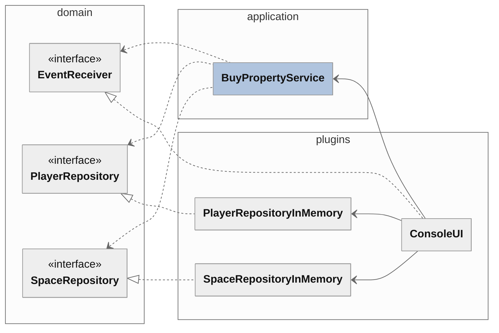
```mermaid
---
config:
  theme: neutral
  class:
    hideEmptyMembersBox: true
---
classDiagram
direction LR
namespace domain {
	class EventReceiver {<<interface>>}
	class PlayerRepository {<<interface>>}
	class SpaceRepository {<<interface>>}
}
namespace application {
	class BuyPropertyService
}
namespace plugins {
	class ConsoleUI
	class PlayerRepositoryInMemory
	class SpaceRepositoryInMemory
}
EventReceiver <.. BuyPropertyService
PlayerRepository <.. BuyPropertyService
SpaceRepository <.. BuyPropertyService

BuyPropertyService <-- ConsoleUI
PlayerRepositoryInMemory <-- ConsoleUI
SpaceRepositoryInMemory <-- ConsoleUI
EventReceiver <|.. ConsoleUI

PlayerRepository <|.. PlayerRepositoryInMemory
SpaceRepository <|.. SpaceRepositoryInMemory

style BuyPropertyService fill:lightsteelblue
```

### Analyse der Schichten

_[jeweils 1 Klasse zu 2 unterschiedlichen Schichten der Clean-Architecture: jeweils UML der Klasse (ggf. auch zusammenspielenden Klassen), Beschreibung der Aufgabe, Einordnung mit Begründung in die Clean-Architecture]_

#### Schicht: Domain

Die Klasse `TaxSpace` repräsentiert ein Spielfeld, wobei der Spieler beim Betreten Steuern an die Bank zahlen muss. Es befindet sich in der Domain-Schicht, da es zur zentralen Anwendungslogik gehört und ist eine konkrete Realisierung der abstrakten Klasse `BoardSpace`. Ein `TaxSpace` wird mit einem festen Wert `tax` für die Steuer initialisiert. Beim Betreten des Spielfelds wird vom `MovementService` die Methode `enterSpace` aufgerufen, die dem betroffenen Spieler die entsprechende Steuer abzieht. Verwaltet werden die `TaxSpace`-Objekte so wie alle `BoardSpace`-Objekte im `SpaceRepository`.

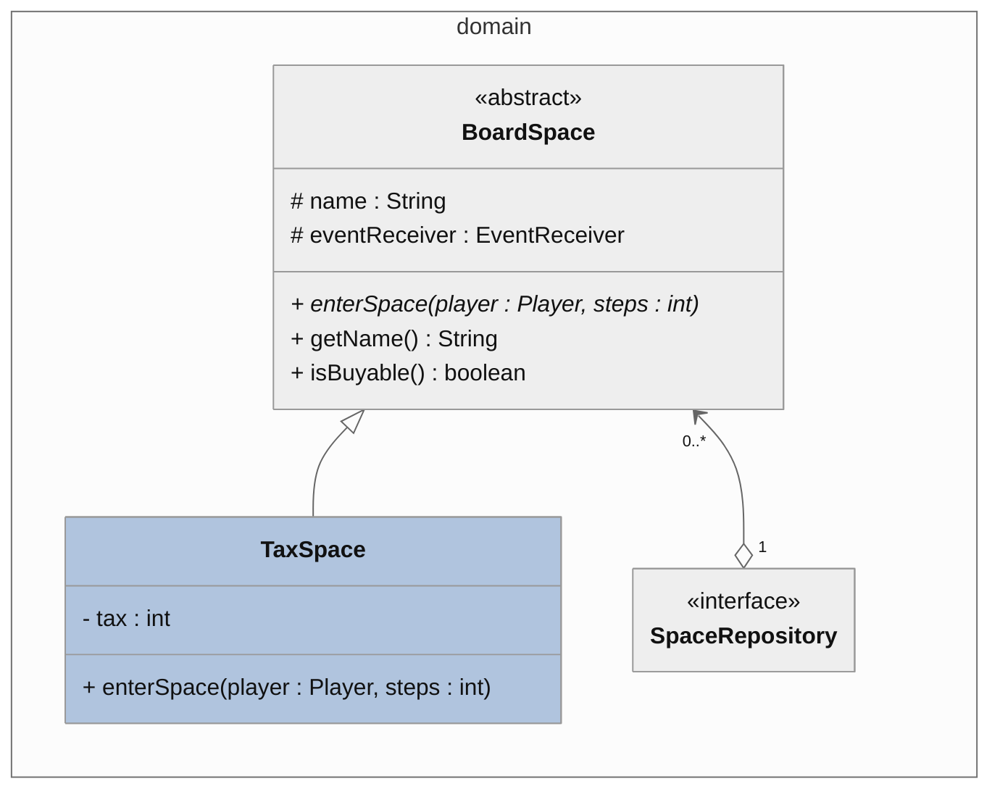
```mermaid
---
config:
  theme: neutral
  class:
    hideEmptyMembersBox: true
---
classDiagram
direction LR
namespace domain {
	class BoardSpace {
		<<abstract>>
		# name : String
		# eventReceiver : EventReceiver
		+ enterSpace(player : Player, steps : int) *
		+ getName() String
		+ isBuyable() boolean
	}
	class TaxSpace {
		- tax : int
		+ enterSpace(player : Player, steps : int)
	}
	class SpaceRepository { <<interface>> }
}
BoardSpace <|-- TaxSpace
BoardSpace "0..*" <--o "1" SpaceRepository
style TaxSpace fill:lightsteelblue
```

#### Schicht: Application

Die Klasse `RollDiceService` beschreibt den Use Case, in dem ein Spieler würfelt. Daraus können unterschiedliche Aktionen folgen. So könnte der Spieler auf dem Spielfeld vorrücken oder versuchen aus dem Gefängnis frei zu kommen. Da der Service einen Use Case beschreibt, befindet er sich in der Application-Schicht. Über das Interface `EventReceiver` sendet er Events an die Oberfläche. Über das Interface `PlayerRepository` greift er auf Spieler-Objekte zu. Über den `MovementService` steuert er die Bewegung des aktuellen Spielers. Der `RollDiceService` wird über die `ConsoleUI` gestartet.

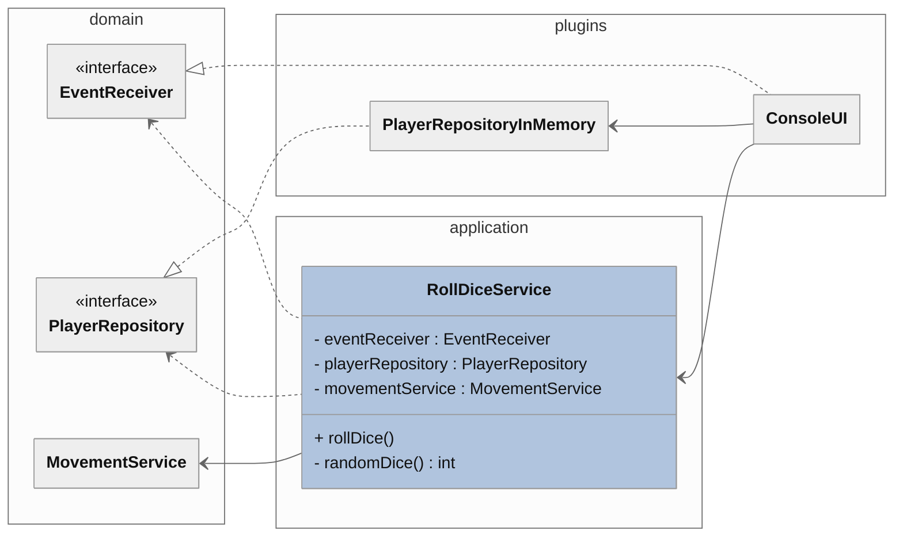
```mermaid
---
config:
  theme: neutral
  class:
    hideEmptyMembersBox: true
---
classDiagram
direction LR
namespace domain {
	class EventReceiver {<<interface>>}
	class PlayerRepository {<<interface>>}
	class MovementService
}
namespace application {
	class RollDiceService {
		- eventReceiver : EventReceiver
		- playerRepository : PlayerRepository
		- movementService : MovementService
		+ rollDice()
		- randomDice() int
	}
}
namespace plugins {
	class PlayerRepositoryInMemory
	class ConsoleUI
}
RollDiceService <-- ConsoleUI

EventReceiver <.. RollDiceService
PlayerRepository <.. RollDiceService
MovementService <-- RollDiceService

PlayerRepositoryInMemory <-- ConsoleUI
EventReceiver <|.. ConsoleUI
PlayerRepository <|.. PlayerRepositoryInMemory

style RollDiceService fill:lightsteelblue
```

## Kapitel 3: SOLID

### Analyse Single-Responsibility-Principle (SRP)

_[jeweils eine Klasse als positives und negatives Beispiel für SRP;  jeweils UML der Klasse und Beschreibung der Aufgabe bzw. der Aufgaben und möglicher Lösungsweg des Negativ-Beispiels (inkl. UML)]_

#### Positiv-Beispiel

Die Klasse `ActionCardService` enthält eine öffentliche Methode die nur einen Zweck erfüllt: Der Spieler zieht eine Aktionskarte des angegebenen Typs und führt die dadurch definierte Aktion aus. Die einzelnen Teilaufgaben werden an weitere private Methoden delegiert. Damit hat die Klasse nur eine Dimension der Änderung und nur eine Zuständigkeit. Sie erfüllt also das Single Responsibility Principle.

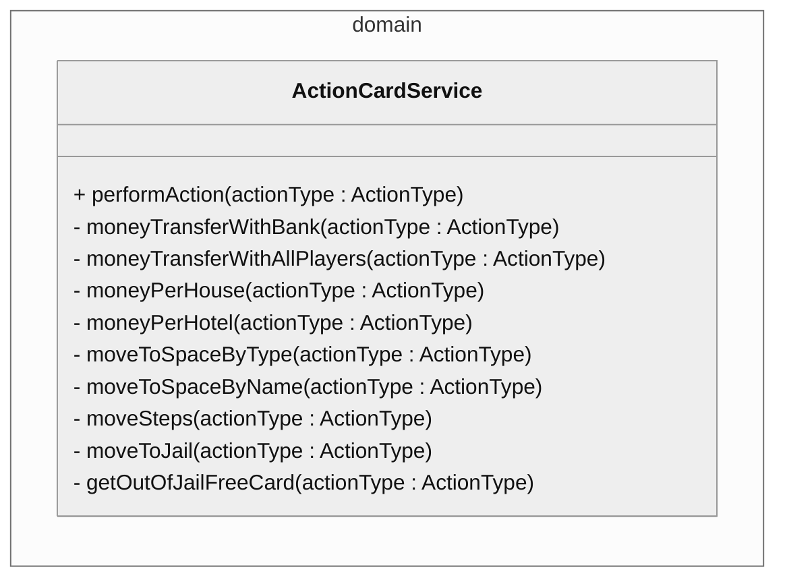
```mermaid
---
config:
  theme: neutral
  class:
    hideEmptyMembersBox: true
---
classDiagram
direction LR

namespace domain {
	class ActionCardService {
		+ performAction(actionType : ActionType)
		- moneyTransferWithBank(actionType : ActionType)
		- moneyTransferWithAllPlayers(actionType : ActionType)
		- moneyPerHouse(actionType : ActionType)
		- moneyPerHotel(actionType : ActionType)
		- moveToSpaceByType(actionType : ActionType)
		- moveToSpaceByName(actionType : ActionType)
		- moveSteps(actionType : ActionType)
		- moveToJail(actionType : ActionType)
		- getOutOfJailFreeCard(actionType : ActionType)
	}
}
```

#### Negativ-Beispiel

Die Klasse `TurnChangeService` hat drei öffentliche Methoden. Sie werden alle von `ConsoleUI` aufgerufen und haben gemeinsame Abhängigkeiten zu `EventReceiver` und `PlayerRepository`. Deshalb ist es praktisch, diese in einer gemeinsamen Klasse unterzubringen. Allerdings haben die Methoden inhaltlich nichts miteinander zu tun. Sie beschreiben unterschiedliche Use Cases, die über die Benutzerschnittstelle gestartet werden können: Der Spieler kann auf eigene Kosten das Gefängnis verlassen, er kann seinen Spielzug beenden und an den nächsten Spieler weitergeben und er kann aufgeben und das Spiel verlassen.

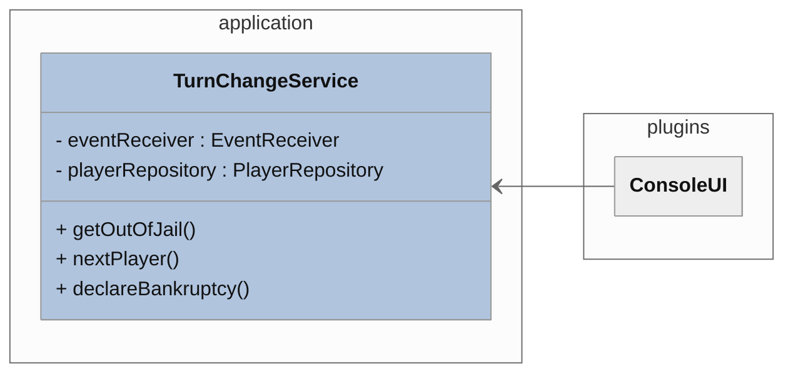
```mermaid
---
config:
  theme: neutral
  class:
    hideEmptyMembersBox: true
---
classDiagram
direction LR

namespace application {
	class TurnChangeService {
		- eventReceiver : EventReceiver
		- playerRepository : PlayerRepository
		+ getOutOfJail()
		+ nextPlayer()
		+ declareBankruptcy()
	}
}
namespace plugins {
	class ConsoleUI
}
TurnChangeService <-- ConsoleUI

style TurnChangeService fill:lightsteelblue
```

Dadurch hat die Klasse mehrere Zuständigkeiten und mehrere Änderungsdimensionen. Und das verstößt gegen das Single Responsibility Principle. Das Problem lässt sich lösen, indem die Methoden in jeweils eigene Services also eigene Klassen verschoben werden.

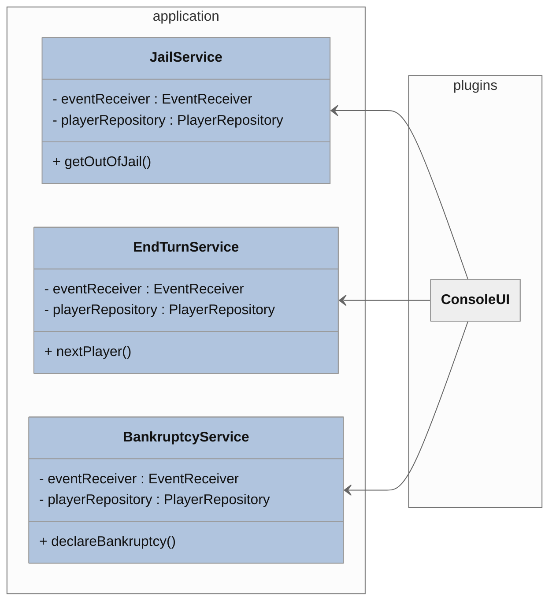
```mermaid
---
config:
  theme: neutral
  class:
    hideEmptyMembersBox: true
---
classDiagram
direction LR

namespace application {
	class JailService:::blue {
		- eventReceiver : EventReceiver
		- playerRepository : PlayerRepository
		+ getOutOfJail()
	}
	class EndTurnService:::blue {
		- eventReceiver : EventReceiver
		- playerRepository : PlayerRepository
		+ nextPlayer()
	}
	class BankruptcyService:::blue {
		- eventReceiver : EventReceiver
		- playerRepository : PlayerRepository
		+ declareBankruptcy()
	}
}
namespace plugins {
	class ConsoleUI
}
JailService <-- ConsoleUI
EndTurnService <-- ConsoleUI
BankruptcyService <-- ConsoleUI

classDef blue fill:lightsteelblue
```

### Analyse Open-Closed-Principle (OCP)

_[jeweils eine Klasse als positives und negatives Beispiel für OCP;  jeweils UML der Klasse und Analyse mit Begründung, warum das OCP erfüllt/nicht erfüllt wurde – falls erfüllt: warum hier sinnvoll/welches Problem gab es? Falls nicht erfüllt: wie könnte man es lösen (inkl. UML)?]_

#### Positiv-Beispiel

Die Klasse `BoardSpace` ist eine Entity und die Oberklasse aller Felder auf dem Spielfeld. Sie stellt die abstrakte Methode `enterSpace` bereit, die aufgerufen wird, wenn ein Spieler dieses Spielfeld betritt. Die konkrete Logik wird in den Unterklassen implementiert. Wenn z.B. ein Spieler ein `PropertySpace` eines anderen Spielers betritt, muss er Miete bezahlen. Möchte man in Zukunft weitere arten von Feldern hinzufügen, kann einfach eine neue Unterklasse von `BoardSpace` ergänzt werden. Diese implementiert die abstrakte Methode und fügt damit neue Logik hinzu, ohne bestehenden Code anpassen zu müssen. Daher ist die Klasse offen für Erweiterungen, verschlossen gegenüber Modifikationen und erfüllt das Open Closed Principle.

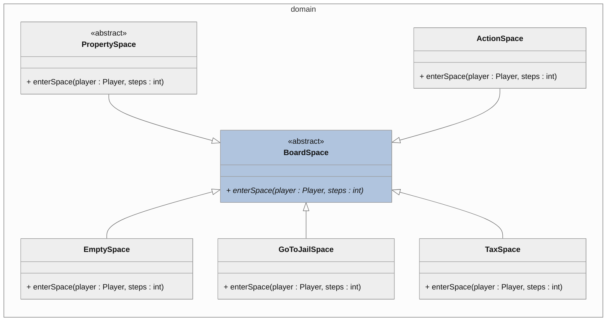
```mermaid
---
config:
  theme: neutral
  class:
    hideEmptyMembersBox: true
---
classDiagram
direction LR
namespace domain {
	class BoardSpace {
		<<abstract>>
		+ enterSpace(player : Player, steps : int) *
	}
	class ActionSpace {
		+ enterSpace(player : Player, steps : int)
	}
	class PropertySpace {
		<<abstract>>
		+ enterSpace(player : Player, steps : int)
	}
	class EmptySpace {
		+ enterSpace(player : Player, steps : int)
	}
	class GoToJailSpace {
		+ enterSpace(player : Player, steps : int)
	}
	class TaxSpace {
		+ enterSpace(player : Player, steps : int)
	}
}
PropertySpace --|> BoardSpace
ActionSpace --|> BoardSpace
BoardSpace <|-- EmptySpace
BoardSpace <|-- GoToJailSpace
BoardSpace <|-- TaxSpace

style BoardSpace fill:lightsteelblue
```

#### Negativ-Beispiel

Die Methode `readAndExecuteCommand()` der Klasse `ConsoleUI` ist dafür zuständig, einen Befehl im Terminal einzulesen und je nach Befehl einen unterschiedlichen Use Case bzw. Service zu starten. Dafür wird ein Switch Statement eingesetzt. Für die Befehle "build" und "unbuild" gibt es zusätzliche Logik für die Verarbeitung des Parameters, der angibt, auf welchem Grundstück gebaut werden soll. Möchte man weitere Befehle für den Spieler hinzufügen, muss das Switch Statement angepasst werden. Dadurch wird das Open Closed Principle verletzt.

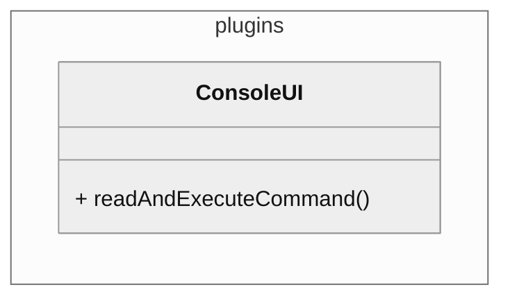
```mermaid
---
config:
  theme: neutral
  class:
    hideEmptyMembersBox: true
---
classDiagram
direction LR
namespace plugins {
	class ConsoleUI {
		+ readAndExecuteCommand()
	}
}
```

```java
private void readAndExecuteCommand() {
  ...
  switch (tokens[0]) {
    case "help":
      printHelp();
      break;
    case "quit":
      System.exit(0);
      break;
    case "roll":
      rollDiceService.rollDice();
      break;
    case "buy":
      buyPropertyService.buyProperty();
      break;
	...
  }
  ...
}
```

Um dies zu verhindern wird eine neue Klasse `Command` eingeführt, die einen Befehl repräsentiert. Das Attribut `command` gibt den Befehl als Zeichenkette an, auf den das Objekt reagieren soll. Die Klasse hat eine abstrakte Methode `run()`. Diese kann entweder in einer regulären Subklasse oder in einer anonymen Klasse implementiert werden und enthält den Aufruf des Use Case Services.

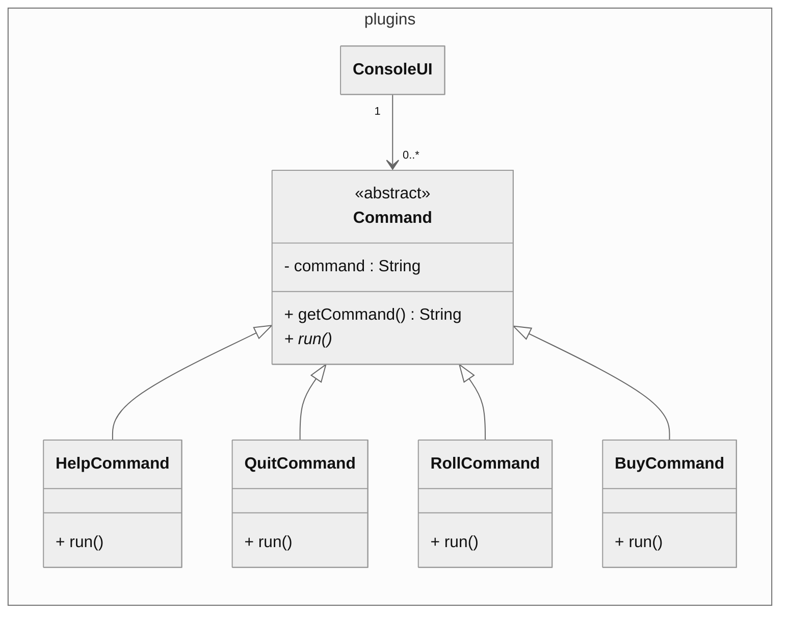
```mermaid
---
config:
  theme: neutral
  class:
    hideEmptyMembersBox: true
---
classDiagram
direction LR

namespace plugins {
	class ConsoleUI {

	}
	class Command {
		<<abstract>>
		- command : String
		+ getCommand() String
		+ run() *
	}
	class HelpCommand {
		+ run()
	}
	class QuitCommand {
		+ run()
	}
	class RollCommand {
		+ run()
	}
	class BuyCommand {
		+ run()
	}
}
ConsoleUI "1" --> "0..*" Command
Command <|-- HelpCommand
Command <|-- QuitCommand
Command <|-- RollCommand
Command <|-- BuyCommand
```

In der Methode `readAndExecuteCommand()` muss jetzt lediglich mit einer Schleife über alle `Command`-Objekte iteriert werden. Es wird jeweils der Befehl ausgelesen und mit der Eingabe verglichen. Stimmen sie überein, wird der Befehl über die `run()`-Methode ausgeführt.

```java
private void readAndExecuteCommand() {
	...
	for (Command command : commands) {
		if (command.getCommand().equals(tokens[0])) {
			command.run();
		}
	}
	...
}
```

### Interface-Segregation-Principle (ISP)

_[jeweils eine Klasse als positives und negatives Beispiel für entweder LSP oder ISP oder DIP);  jeweils UML der Klasse und Begründung, warum man hier das Prinzip erfüllt/nicht erfüllt wird]_

_[Anm.: es darf nur ein Prinzip ausgewählt werden; es darf NICHT z.B. ein positives Beispiel für LSP und ein negatives Beispiel für ISP genommen werden]_

#### Positiv-Beispiel

Das Interface `EventReceiver` erfüllt das Interface Segregation Principle optimal. Da es nur eine Methode enthält, kann es nicht weiter unterteilt werden.

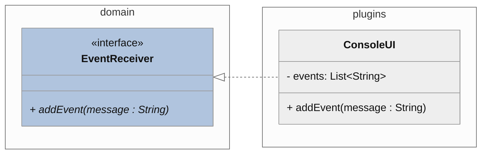
```mermaid
---
config:
  theme: neutral
---
classDiagram
direction LR
namespace domain {
	class EventReceiver {
		<<interface>>
		+ addEvent(message : String) *
	}
}
namespace plugins {
	class ConsoleUI {
		- events: List~String~
		+ addEvent(message : String)
	}
}
EventReceiver <|.. ConsoleUI

style EventReceiver fill:lightsteelblue
```

#### Negativ-Beispiel

Das Interface `SpaceRepository` enthält viele Methoden. Es gibt keinen Service, der alle davon verwendet. Manche Methoden werden von nur einem einzigen Service aufgerufen. Alle weiteren Services hätten zwar Zugriff auf diese Methoden, verwenden sie jedoch nicht. Deshalb erfüllt das Interface das Interface Segregation Principle hier nicht. Um das Prinzip einzuhalten, könnte `SpaceRepository` in mehrere kleinere Interfaces unterteilt zerteilt werden.

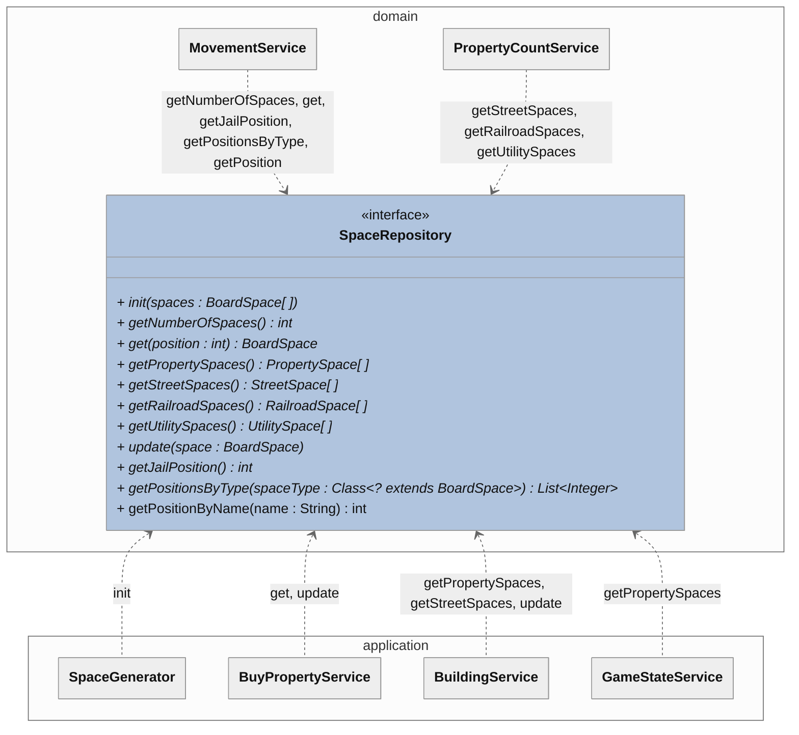
```mermaid
---
config:
  theme: neutral
  class:
    hideEmptyMembersBox: true
---
classDiagram

namespace domain {
	class SpaceRepository {
		<<interface>>
		+ init(spaces : BoardSpace[ ]) *
		+ getNumberOfSpaces() int *
		+ get(position : int) BoardSpace *
		+ getPropertySpaces() PropertySpace[ ] *
		+ getStreetSpaces() StreetSpace[ ] *
		+ getRailroadSpaces() RailroadSpace[ ] *
		+ getUtilitySpaces() UtilitySpace[ ] *
		+ update(space : BoardSpace) *
		+ getJailPosition() int *
		+ getPositionsByType(spaceType : Class~? extends BoardSpace~) List~Integer~ *
		+ getPositionByName(name : String) int
	}
	class MovementService
	class PropertyCountService
}
namespace application {
	class SpaceGenerator
	class BuyPropertyService
	class BuildingService
	class GameStateService
}
MovementService ..> SpaceRepository : getNumberOfSpaces, get, getJailPosition, getPositionsByType, getPosition
PropertyCountService ..> SpaceRepository : getStreetSpaces, getRailroadSpaces, getUtilitySpaces

SpaceRepository <.. SpaceGenerator : init
SpaceRepository <.. BuyPropertyService : get, update
SpaceRepository <.. BuildingService : getPropertySpaces, getStreetSpaces, update
SpaceRepository <.. GameStateService : getPropertySpaces

style SpaceRepository fill:lightsteelblue
```

## Kapitel 4: Weitere Prinzipien

### Analyse GRASP: Geringe Kopplung

_[jeweils eine bis jetzt noch nicht behandelte Klasse als positives und negatives Beispiel geringer Kopplung; jeweils UML Diagramm mit zusammenspielenden Klassen, Aufgabenbeschreibung und Begründung für die Umsetzung der geringen Kopplung bzw. Beschreibung, wie die Kopplung aufgelöst werden kann]_

#### Positiv-Beispiel

Die Klasse `Player` modelliert die Entität eines Spielers inklusive Werten wie der Position auf dem Spielbrett oder der Kontostand. Die Klasse selbst greift auf keine anderen Klassen der Anwendung zu. Die Spielerobjekte werden über eine konkrete Implementierung des entsprechenden Repositories verwaltet. Darüber greifen verschiedene Services auf die Spieler zu. Durch die geringe Kopplung der Klasse `Player` lässt sie sich vielseitig wie­der­ver­wen­den.

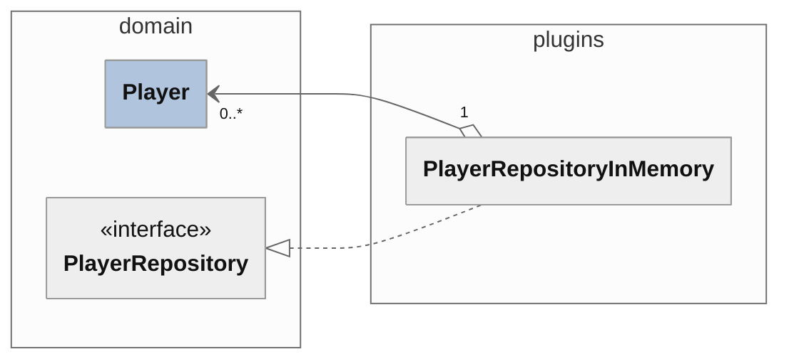
```mermaid
---
config:
  theme: neutral
  class:
    hideEmptyMembersBox: true
---
classDiagram
direction LR

namespace domain {
	class Player
	class PlayerRepository { <<interface>> }
}
namespace plugins {
	class PlayerRepositoryInMemory
}

Player "0..*" <--o "1" PlayerRepositoryInMemory
PlayerRepository <|.. PlayerRepositoryInMemory

style Player fill:lightsteelblue
```

#### Negativ-Beispiel

Die Klasse `ConsoleUI` implementiert die Schnittstelle zum Benutzer der Anwendung über das Terminal. Sie hat eine hohe Kopplung, da hier alle Repositories und Services instanziiert werden. Sie verwendet außerdem weitere Klassen wie `ConsoleFormatter`, die ebenfalls Logik der Benutzeroberfläche enthalten. Sie ist der zentrale Einstiegspunkt, der alle Klassen zusammenbringt, weshalb es schwer möglich ist, die Kopplung aufzulösen. Einige der Services werden hier nur instanziiert, um deren Objekte an andere Objekte weiterzugeben, obwohl sie in der Klasse `ConsoleUI` selbst nicht direkt verwendet werden. Um die Assoziationen zwischen den Objekten aufzubauen, könnte ein Framework wie Spring eingesetzt werden, welches Annotationen für Dependency Injection unterstützt. Dadurch könnten manche der Abhängigkeiten der Klasse `ConsoleUI` eingespart werden.

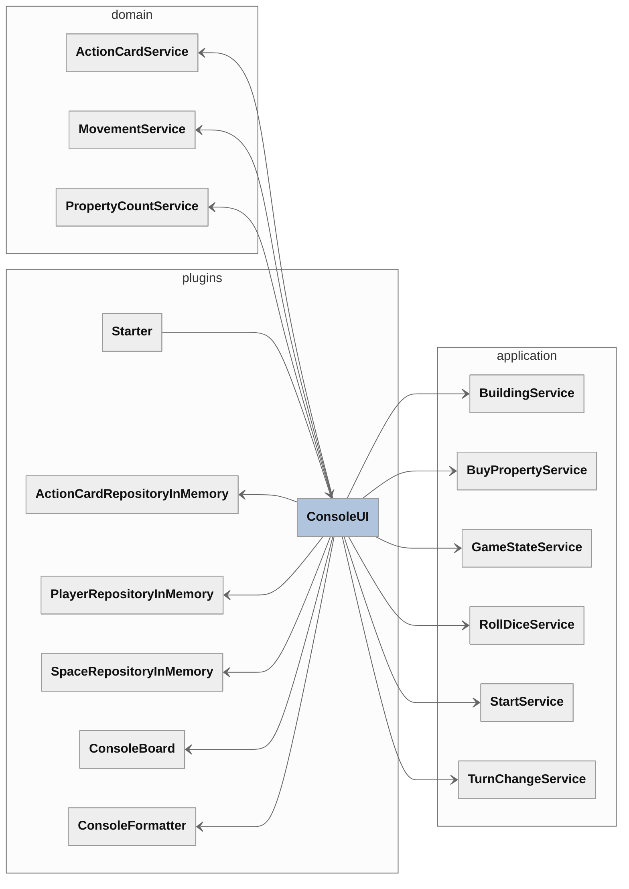
```mermaid
---
config:
  theme: neutral
  class:
    hideEmptyMembersBox: true
---
classDiagram
direction LR

namespace domain {
	class ActionCardService
	class MovementService
	class PropertyCountService
}
namespace application {
	class BuildingService
	class BuyPropertyService
	class GameStateService
	class RollDiceService
	class StartService
	class TurnChangeService
}
namespace plugins {
	class ConsoleUI
	class Starter
	class ActionCardRepositoryInMemory
	class PlayerRepositoryInMemory
	class SpaceRepositoryInMemory
	class ConsoleBoard
	class ConsoleFormatter
}
ActionCardService <-- ConsoleUI
MovementService <-- ConsoleUI
PropertyCountService <-- ConsoleUI

ConsoleUI --> BuildingService
ConsoleUI --> BuyPropertyService
ConsoleUI --> GameStateService
ConsoleUI --> RollDiceService
ConsoleUI --> StartService
ConsoleUI --> TurnChangeService

Starter --> ConsoleUI
ActionCardRepositoryInMemory <-- ConsoleUI
PlayerRepositoryInMemory <-- ConsoleUI
SpaceRepositoryInMemory <-- ConsoleUI
ConsoleBoard <-- ConsoleUI
ConsoleFormatter <-- ConsoleUI

style ConsoleUI fill:lightsteelblue
```

### Analyse GRASP: Hohe Kohäsion

_[eine Klasse als positives Beispiel hoher Kohäsion; UML Diagramm und Begründung, warum die Kohäsion hoch ist]_

Die Klasse `ConsoleBoard` hat nur eine Aufgabe, die über die einzige öffentliche Methode `get` aufgerufen werden kann: Sie erstellt das Spielbrett als Zeichenkette für die Terminal-Oberfläche. Dabei werden die Spieler übergeben, die an ihrer aktuellen Position auf dem Spielbrett angezeigt werden. Die beiden weiteren Methoden übernehmen Teilaufgaben davon und werden von der Methode `get` aufgerufen. Alle Methoden der Klasse hängen somit eng miteinander zusammen, um einen gemeinsamen Zweck zu erfüllen. Daher ist die Kohäsion der Klasse hoch.

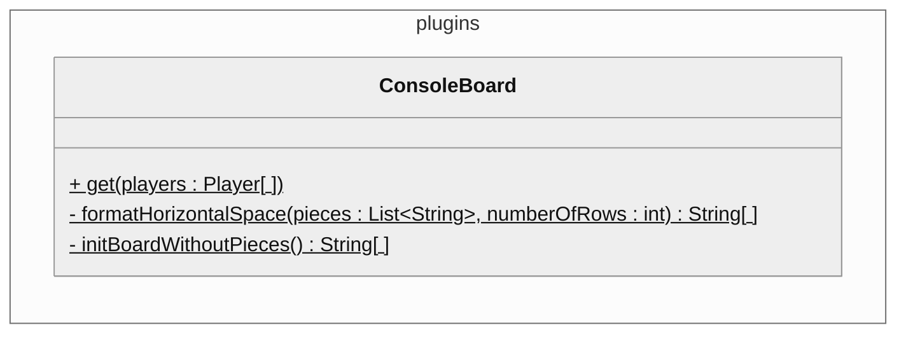
```mermaid
---
config:
  theme: neutral
  class:
    hideEmptyMembersBox: true
---
classDiagram
direction LR
namespace plugins {
	class ConsoleBoard {
		+ get(players : Player[ ]) $
		- formatHorizontalSpace(pieces : List~String~, numberOfRows : int) String[ ] $
		- initBoardWithoutPieces() String[ ] $
	}
}
```

### Don’t Repeat Yourself (DRY)

_[ein Commit angeben, bei dem duplizierter Code/duplizierte Logik aufgelöst wurde; Code-Beispiele (vorher/nachher); begründen und Auswirkung beschreiben]_

Die Methoden `buildOnSpace` und `unbuildOnSpace` des `BuildingService` enthalten Logik zur Verifizierung des Parameters `propertyId`. Es wird geprüft, ob dieser im gültigen Wertebereich liegt, ob das identifizierte Grundstück eine Straße ist und ob der aktuelle Spieler das Grundstück besitzt. Der spieler und der `PropertySpace` werden aus den entsprechenden Repositories abgefragt. Diese Logik ist in beiden Methoden redundant vorhanden.

```java
public void buildOnSpace(int propertyId) {
  Player currentPlayer = playerRepository.getCurrentPlayer();
  PropertySpace[] propertySpaces = spaceRepository.getPropertySpaces();
  int maxPropertyId = propertySpaces.length - 1;

  // id out of range
  if (propertyId < 0 || propertyId > maxPropertyId) {
    eventReceiver.addEvent(String.format("The property identifier must be between 0 and %d.", maxPropertyId));
    return;
  }
  PropertySpace propertySpace = propertySpaces[propertyId];

  // property does not belong to a color group
  if (!(propertySpace instanceof StreetSpace)) {
    eventReceiver.addEvent("You can not build on railroads and utility spaces.");
    return;
  }
  StreetSpace streetSpace = (StreetSpace) propertySpace;

  // player is not the owner
  if (!streetSpace.isOwnedBy(currentPlayer)) {
    eventReceiver.addEvent("You can only build on your own property.");
    return;
  }
  ...
}

public void unbuildOnSpace(int propertyId) {
  Player currentPlayer = playerRepository.getCurrentPlayer();
  PropertySpace[] propertySpaces = spaceRepository.getPropertySpaces();
  int maxPropertyId = propertySpaces.length - 1;

  // id out of range
  if (propertyId < 0 || propertyId > maxPropertyId) {
    eventReceiver.addEvent(String.format("The property identifier must be between 0 and %d.", maxPropertyId));
    return;
  }
  PropertySpace propertySpace = propertySpaces[propertyId];

  // property does not belong to a color group
  if (!(propertySpace instanceof StreetSpace)) {
    eventReceiver.addEvent("You can not build on railroads and utility spaces.");
    return;
  }
  StreetSpace streetSpace = (StreetSpace) propertySpace;

  // player is not the owner
  if (!streetSpace.isOwnedBy(currentPlayer)) {
    eventReceiver.addEvent("You can only build on your own property.");
    return;
  }
  ...
}
```

Im Commit [`f8dc790`](https://github.com/OG-NI/monopoly/commit/f8dc7908b11b151540e1437928b53cf7aede5e3b) wurde diese duplizierte Logik in eine eigene Methode ausgelagert. Falls die `propertyId` eine der zuvor beschriebenen Bedingungen nicht erfüllt, wird eine `PropertyIdException` geworfen.

```java
public void buildOnSpace(int propertyId) {
  StreetSpace streetSpace;
  try {
    streetSpace = parsePropertyId(propertyId);
  } catch (PropertyIdException exception) {
    return;
  }
  ...
}

public void unbuildOnSpace(int propertyId) {
  StreetSpace streetSpace;
  try {
    streetSpace = parsePropertyId(propertyId);
  } catch (PropertyIdException exception) {
    return;
  }
  ...
}

private StreetSpace parsePropertyId(int propertyId) throws PropertyIdException {
  PropertySpace[] propertySpaces = spaceRepository.getPropertySpaces();
  int maxPropertyId = propertySpaces.length - 1;

  // id out of range
  if (propertyId < 0 || propertyId > maxPropertyId) {
    eventReceiver.addEvent(String.format("The property identifier must be between 0 and %d.", maxPropertyId));
    throw new PropertyIdException();
  }
  PropertySpace propertySpace = propertySpaces[propertyId];

  if (!(propertySpace instanceof StreetSpace)) {
    eventReceiver.addEvent("You can not build on railroads and utility spaces.");
    throw new PropertyIdException();
  }
  StreetSpace streetSpace = (StreetSpace) propertySpace;

  Player currentPlayer = playerRepository.getCurrentPlayer();
  if (!streetSpace.isOwnedBy(currentPlayer)) {
    eventReceiver.addEvent("You can only build on your own property.");
    throw new PropertyIdException();
  }

  return streetSpace;
}

private class PropertyIdException extends Exception {
}
```

## Kapitel 5: Unit Tests

### 10 Unit Tests

_[Nennung von 10 Unit-Tests und Beschreibung, was getestet wird]_

| Unit Test                                         | Beschreibung                                                                                                          |
| ------------------------------------------------- | --------------------------------------------------------------------------------------------------------------------- |
| ActionCardServiceTest.moneyTransferWithAllPlayers | Wenn der aktuelle Spieler eine bestimmte `ActionCard` zieht, erhält er vom anderen Spieler $10.                       |
| ActionCardServiceTest.moneyPerHouse               | Wenn der aktuelle Spieler eine bestimmte `ActionCard` zieht, zahlt er $100 pro Gebäude, also insgesamt $200.          |
| ActionCardServiceTest.getOutOfJailFreeCard        | Wenn der aktuelle Spieler eine bestimmte `ActionCard` zieht, bekommt er eine "komme aus dem Gefängnis frei"-Karte.    |
| MovementServiceTest.passGoAndCollect200Dollar     | Wenn der aktuelle Spieler das Feld "Go" erneut betritt, bekommt er $200.                                              |
| MovementServiceTest.moveToSpaceByName             | Der Aufruf der Methode mit einem bestimmten Namen bewegt den aktuellen Spieler zum Spielfeld mit dem Namen.           |
| MovementServiceTest.moveToSpaceByNameBehindPlayer | Der Spieler bewegt sich auch dann zu dem richtigen Feld mit einem bestimmten Namen, wenn es hinter ihm liegt.         |
| MovementServiceTest.moveToJail                    | Der Aufruf der Methode befördert den aktuellen Spieler ins Gefängnis.                                                 |
| StreetSpaceTest.getRentWithWholeColorGroup        | Wenn der Spieler die gesamte Farbgruppe besitzt und auf dem Grundstück keine Straße steht, verdoppelt sich die Miete. |
| StreetSpaceTest.getRentWithThreeBuildings         | Wenn auf dem Grundstück drei Gebäude stehen, wird die Miete korrekt berechnet.                                        |
| StreetSpaceTest.hasHotelWithFiveBuildings         | Wenn das Grundstück fünfmal bebaut wurde, zählt das als Hotel.                                                        |

### ATRIP: Automatic

_[Begründung/Erläuterung, wie ‘Automatic’ realisiert wurde]_

Die Tests lassen sich mit einem einzigen Befehl (`mvn test`) ausführen. Bei jeder Ausführung von `mvn package` werden die Tests ebenfalls ausgeführt. Es müssen keine Daten manuell eingegeben werden. Es wird automatisch überprüft, ob die zurückgelieferten Ergebnisse richtig sind.

### ATRIP: Thorough

_[jeweils 1 positives und negatives Beispiel zu ‘Thorough’; jeweils Code-Beispiel, Analyse und Begründung, was gründlich/nicht gründlich ist]_

#### Positiv-Beispiel

Der nachfolgende Test fügt in der Schleife viermal hintereinander ein Gebäude hinzu. Nach jedem Mal wird geprüft, ob das Grundstück ein Hotel hat, was nicht der Fall sein sollte. Dann wird ein fünftes Mal gebaut. Erst danach zählt die Bebauung des Grundstücks als Hotel. Das ist besonders gründlich, weil nicht nur geprüft wird, dass das Grundstück am Ende ein Hotel hat, sondern auch, dass es davor kein Hotel hatte.

```java
@Test
public void hasHotelWithFiveBuildings() {
  for (int i = 0; i < 4; i++) {
    streetSpace.addBuilding();
    assertFalse(streetSpace.hasHotel());
  }
  streetSpace.addBuilding();
  assertTrue(streetSpace.hasHotel());
}
```

#### Negativ-Beispiel

Im folgenden Test sorgt die Chance-Karte dafür, dass der aktuelle Spieler von allen anderen Spielern jeweils $10 bekommt. Es wird zwar überprüft, dass der aktuelle Spieler das Geld erhalten hat, nicht aber, dass der andere Spieler das Geld verloren hat. Deshalb ist der Test nicht gründlich. Hinweis: Das Problem wurde im aktuellen Stand bereits behoben.

```java
@Test
public void moneyTransferWithAllPlayers() {
  actionCardRepository.mockActionCard(
      new ActionCard.Builder(ActionType.CHANCE, "").moneyTransferWithAllPlayers(10).build());
  actionCardService.performAction(ActionType.CHANCE);
  assertEquals(playerRepository.getCurrentPlayer().getMoney(), 1510);
}
```

### ATRIP: Professional

_[jeweils 1 positives und negatives Beispiel zu ‘Professional’; jeweils Code-Beispiel, Analyse und Begründung, was professionell/nicht professionell ist]_

#### Positiv-Beispiel

Der folgende Test verwendet die Methode `addBuilding` in einer Schleife um dem Grundstück drei Gebäude hinzuzufügen. Es wird anschließend geprüft, ob die Anzahl der Gebäude korrekt ist. Im letzten Schritt wird geprüft, ob die Miete dem erwarteten Wert entspricht. Dieser Test ist professionell, weil bestehende Methoden verwendet werden und keine Hilfsfunktionen nur für den Test verwendet werden.

```java
@Test
public void getRentWithThreeBuildings() {
  for (int i = 0; i < 3; i++) {
    streetSpace.addBuilding();
  }
  assertEquals(streetSpace.getNumberOfBuildings(), 3);
  assertEquals(streetSpace.getRent(-1), 4);
}
```

#### Negativ-Beispiel

Dieser Test prüft, ob der Getter `getBuildingPrice` den Wert zurückgibt, der im Konstruktor der Klasse `StreetSpace` gesetzt wurde. Das ist nicht professionell, weil keine Logik getestet wird. Hinweis: Dieser unnötige Test wurde im aktuellen Stand bereits entfernt.

```java
@Test
public void getBuildingPrice() {
	assertEquals(streetSpace.getBuildingPrice(), 56);
}
```

### Code Coverage

_[Code Coverage im Projekt analysieren und begründen]_

Die Code-Coverage wird im Projekt mit JaCoCo analysiert. Sie wird automatisch gemessen, wenn die Tests ausgeführt werden. Für die Untermodule der drei Schichten wird die Code-Coverage separat analysiert. Die Code-Coverage kann eingesehen werden, indem die Datei `<layer>/target/site/jacoco/index.html` im Browser geöffnet wird. Bisher existieren Tests explizit nur für die Klassen `StreetSpace`, `ActionCardService` und `MovementService`. Deshalb ist die Code-Coverage insgesamt gering. Auch in diesen Klassen sind bisher nicht alle Fälle durch Tests abgedeckt. Einige andere Klassen haben eine Code-Coverage größer null, da diese indirekt mit getestet werden.

```java
0-domain/ (50%)
├─ entities/ (40%)
│  ├─ ActionSpace (0%)
│  ├─ BoardSpace (64%)
│  ├─ EmptySpace (100%)
│  ├─ GoToJailSpace (0%)
│  ├─ Player (49%)
│  ├─ PropertySpace (40%)
│  ├─ RailRoadSpace (0%)
│  ├─ StreetSpace (84%)
│  ├─ TaxSpace (0%)
│  └─ UtilitySpace (0%)
├─ services/ (67%)
│  ├─ ActionCardService (80%)
│  ├─ MovementService (100%)
│  └─ PropertyCountService (7%)
├─ valueobjects/ (35%)
│  └─ ActionCard (35%)
└─ ActionType (91%)
```

### Fakes und Mocks

_[Analyse und Begründung des Einsatzes von 2 Fake/Mock-Objekten; zusätzlich jeweils UML Diagramm der Klasse]_

#### Mock-Objekt 1

Die Klasse `MockActionCardReposiotry` ist eine Implementierung des Interfaces `ActionCardRepository` zu Testzwecken. Im Gegensatz zur eigentlichen Implementierung (`ActionCardRepositoryInMemory`) wird beim Aufruf von `getRandomCardOfType` keine zufällige Aktionskarte zurückgegeben. In der Mock-Klasse wird immer die gleiche Karte zurückgegeben, die über `mockActionCard` konfiguriert werden kann. So eignet sich die Klasse gut für Tests. Das Objekt der Mock-Klasse wird an den `ActionCardService` in der Testklasse `ActionCardServiceTest` übergeben, wodurch der `ActionCardService` getestet werden kann.

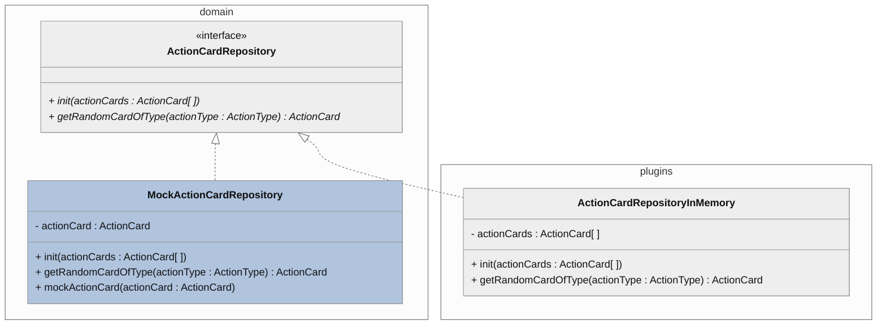
```mermaid
---
config:
  theme: neutral
  class:
    hideEmptyMembersBox: true
---
classDiagram
namespace domain {
	class ActionCardRepository {
		<<interface>>
		+ init(actionCards : ActionCard[ ]) *
		+ getRandomCardOfType(actionType : ActionType) ActionCard *
	}
	class MockActionCardRepository {
		- actionCard : ActionCard
		+ init(actionCards : ActionCard[ ])
		+ getRandomCardOfType(actionType : ActionType) ActionCard
		+ mockActionCard(actionCard : ActionCard)
	}
}
namespace plugins {
	class ActionCardRepositoryInMemory {
		- actionCards : ActionCard[ ]
		+ init(actionCards : ActionCard[ ])
		+ getRandomCardOfType(actionType : ActionType) ActionCard
	}
}
ActionCardRepository <|.. MockActionCardRepository
ActionCardRepository <|.. ActionCardRepositoryInMemory
style MockActionCardRepository fill:lightsteelblue
```

#### Mock-Objekt 2

Das Interface `EventReceiver` wird von verschiedenen Services und Entities verwendet, um Ereignisse an die Oberfläche zu übermitteln. Die konkrete Implementierung findet sich in der Klasse `ConsoleUI`. Da diese Klasse in der Tests der Domain-Schicht nicht verfügbar ist und die Ereignisse in den Tests nicht benötigt werden, gibt es eine Mock-Klasse `MockEventReceiver`, die die Events annimmt aber nicht weiter behandelt. Sie implementiert ebenfalls das Interface und wird in verschiedenen Tests verwendet.

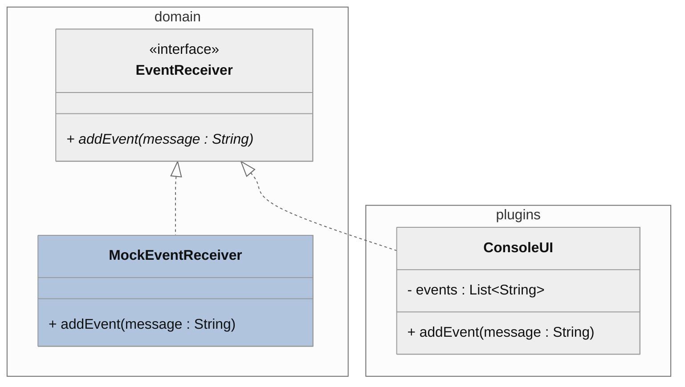
```mermaid
---
config:
  theme: neutral
  class:
    hideEmptyMembersBox: true
---
classDiagram
namespace domain {
	class EventReceiver {
		<<interface>>
		+ addEvent(message : String) *
	}
	class MockEventReceiver {
		+ addEvent(message : String)
	}
}
namespace plugins {
	class ConsoleUI {
		- events : List~String~
		+ addEvent(message : String)
	}
}
EventReceiver <|.. MockEventReceiver
EventReceiver <|.. ConsoleUI
style MockEventReceiver fill:lightsteelblue
```

## Kapitel 6: Domain Driven Design

### Ubiquitous Language

_[4 Beispiele für die Ubiquitous Language; jeweils Bezeichnung, Bedeutung und kurze Begründung, warum es zur Ubiquitous Language gehört]_

| Bezeichung      | Bedeutung                                                               |
| --------------- | ----------------------------------------------------------------------- |
| `StreetSpace`   | Eigentumsfeld Straße (Bestandteil einer Farbgruppe)                     |
| `GoToJailSpace` | Spielfeld, das beim Betreten den Spieler sofort in das Gefängnis bringt |
| `RailroadSpace` | Eigentumsfeld Bahnhof                                                   |
| `UtilitySpace`  | Eigentumsfeld Versorgungsunternehmen (Elektrizitätswert, Wasserwerk)    |

Die genannten Entitäten beschreiben verschiedene Arten von Feldern auf dem Spielbrett. Sie gehören zur Ubiquitous Language, da sie in den [offiziellen Spielregeln](https://instructions.hasbro.com/api/download/C1009_en-us_monopoly-game.pdf) verwendet werden.

### Entities

_[UML, Beschreibung und Begründung des Einsatzes einer Entity; falls keine Entity vorhanden: ausführliche Begründung, warum es keines geben kann/hier nicht sinnvoll ist]_

Die Klasse `BoardSpace` ist eine Entity und beschreibt mit ihren Unterklassen die Felder, aus denen sich das Spielfeld zusammensetzt. Das Spielfeld wird zu Beginn des Spiels initialisiert. Dabei werden Werte wie die Farbgruppe einer Straße oder der Name eines Bahnhofs festgelegt, die sich im Verlauf des Spiels nicht mehr ändern. Hinzu kommen weitere Werte wie die Anzahl der gebauten Häuser auf einer Straße oder der Besitzer eines Grundstücks, die sich verändern können. Deshalb sind sie als Entities modelliert.

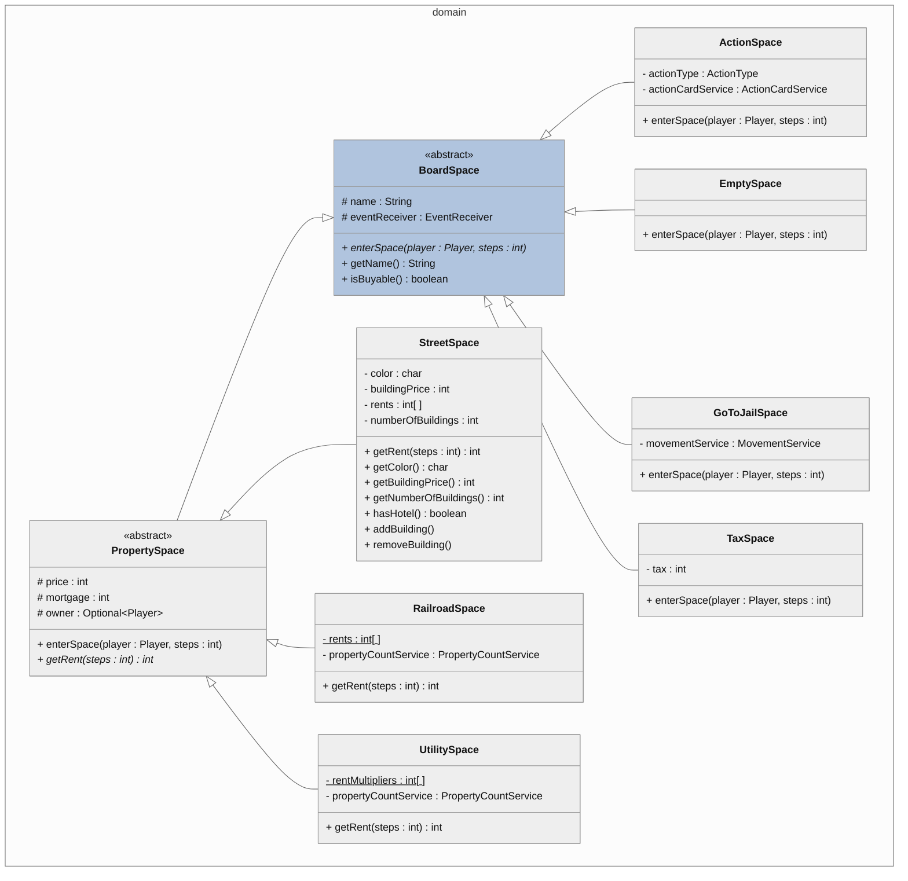
```mermaid
---
config:
  theme: neutral
  class:
    hideEmptyMembersBox: true
---
classDiagram
namespace domain {
	class BoardSpace {
		<<abstract>>
		# name : String
		# eventReceiver : EventReceiver
		+ enterSpace(player : Player, steps : int) *
		+ getName() String
		+ isBuyable() boolean
	}
	class ActionSpace {
		- actionType : ActionType
		- actionCardService : ActionCardService
		+ enterSpace(player : Player, steps : int)
	}
	class PropertySpace {
		<<abstract>>
		# price : int
		# mortgage : int
		# owner : Optional~Player~
		+ enterSpace(player : Player, steps : int)
		+ getRent(steps : int) int *
	}
	class StreetSpace {
		- color : char
		- buildingPrice : int
		- rents : int[ ]
		- numberOfBuildings : int
		+ getRent(steps : int) int
		+ getColor() char
		+ getBuildingPrice() int
		+ getNumberOfBuildings() int
		+ hasHotel() boolean
		+ addBuilding()
		+ removeBuilding()
	}
	class RailroadSpace {
		- rents : int[ ] $
		- propertyCountService : PropertyCountService
		+ getRent(steps : int) int
	}
	class UtilitySpace {
		- rentMultipliers : int[ ] $
		- propertyCountService : PropertyCountService
		+ getRent(steps : int) int
	}
	class EmptySpace {
		+ enterSpace(player : Player, steps : int)
	}
	class GoToJailSpace {
		- movementService : MovementService
		+ enterSpace(player : Player, steps : int)
	}
	class TaxSpace {
		- tax : int
		+ enterSpace(player : Player, steps : int)
	}
}
BoardSpace <|-- ActionSpace
BoardSpace <|-- EmptySpace
BoardSpace <|-- GoToJailSpace
BoardSpace <|-- TaxSpace
PropertySpace --|> BoardSpace
PropertySpace <|-- StreetSpace
PropertySpace <|-- RailroadSpace
PropertySpace <|-- UtilitySpace

style BoardSpace fill:lightsteelblue
```

### Value Objects

_[UML, Beschreibung und Begründung des Einsatzes eines Value Objects; falls kein Value Object vorhanden: ausführliche Begründung, warum es keines geben kann/hier nicht sinnvoll ist]_

Die Klasse `ActionCard` ist ein Value Object dass die Karten beschreibt, die gezogen werden, wenn ein Spieler auf ein Community Chest oder Chance Feld zieht. Zu welcher der beiden Kategorien eine Karte gehört, wird durch das `ActionType` entschieden. Das Feld `text` modelliert den Text, der auf der Karte steht. Die weiteren Felder beschreiben die unterschiedlichen Aktionen, die beim Ziehen der Karte für den Spieler folgen. Die Objekte der Klasse werden beim Spielstart erstellt und danach nicht mehr verändert. Alle Attribute sind Konstanten. Deshalb ist es ein Value Object.

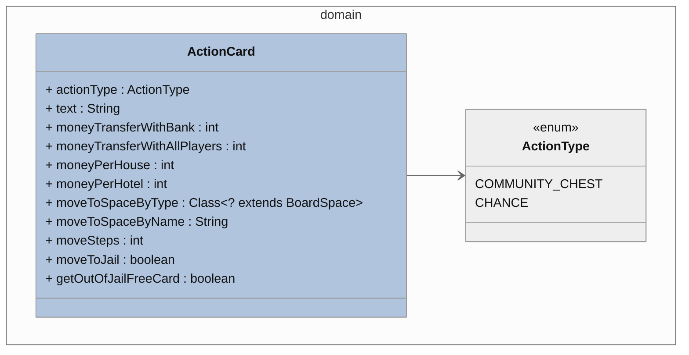
```mermaid
---
config:
  theme: neutral
---
classDiagram
namespace domain {
	class ActionCard {
		+ actionType : ActionType
		+ text : String
		+ moneyTransferWithBank : int
		+ moneyTransferWithAllPlayers : int
		+ moneyPerHouse : int
		+ moneyPerHotel : int
		+ moveToSpaceByType : Class~? extends BoardSpace~
		+ moveToSpaceByName : String
		+ moveSteps : int
		+ moveToJail : boolean
		+ getOutOfJailFreeCard : boolean
	}
	class ActionType {
		<<enum>>
		COMMUNITY_CHEST
		CHANCE
	}
}
ActionCard --> ActionType

style ActionCard fill:lightsteelblue
```

### Repositories

_[UML, Beschreibung und Begründung des Einsatzes eines Repositories; falls kein Repository vorhanden: ausführliche Begründung, warum es keines geben kann/hier nicht sinnvoll ist]_

Das `PlayerRepository` verwaltet die Spieler. Es ist als Interface umgesetzt, welches von unterschiedlichen Klassen implementiert werden kann, um unterschiedliche Arten der Speicherung zu unterstützen. Die Klasse `PlayeRepositoryInMemory` speichert die Spieler als Objekte im Hauptspeicher. Die Spielerobjekte sind Entitäten und werden vor Spielbeginn mit einer Eingabe durch den Nutzer initialisiert. Das Repository bietet verschiedene Methoden, um bestimmte einzelne Spieler oder mehrere auf einmal abzufragen.

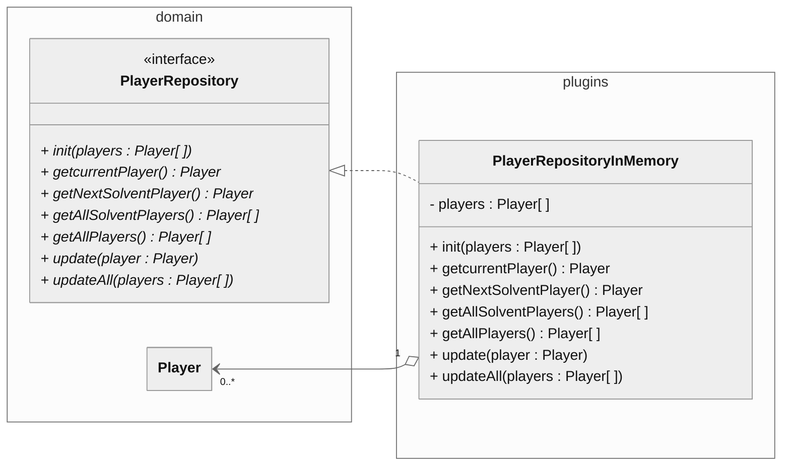
```mermaid
---
config:
  theme: neutral
  class:
    hideEmptyMembersBox: true
---
classDiagram
direction LR

namespace domain {
	class PlayerRepository {
		<<interface>>
		+ init(players : Player[ ]) *
		+ getcurrentPlayer() Player *
		+ getNextSolventPlayer() Player *
		+ getAllSolventPlayers() Player[ ] *
		+ getAllPlayers() Player[ ] *
		+ update(player : Player) *
		+ updateAll(players : Player[ ]) *
	}
	class Player
}
namespace plugins {
	class PlayerRepositoryInMemory {
		- players : Player[ ]
		+ init(players : Player[ ])
		+ getcurrentPlayer() Player
		+ getNextSolventPlayer() Player
		+ getAllSolventPlayers() Player[ ]
		+ getAllPlayers() Player[ ]
		+ update(player : Player)
		+ updateAll(players : Player[ ])
	}
}

PlayerRepository <|.. PlayerRepositoryInMemory
Player "0..*" <--o "1" PlayerRepositoryInMemory
```

### Aggregates

_[UML, Beschreibung und Begründung des Einsatzes eines Aggregates; falls kein Aggregate vorhanden: ausführliche Begründung, warum es keines geben kann/hier nicht sinnvoll ist]_

Die Anwendung hat keine Aggregates. Insgesamt hat das Spiel Monopoly wenige Daten und somit auch wenige verschiedene Entitäten und Value Objects. Spieler lassen sich nicht zu einer Gruppe zuordnen. Spielfeld-Entitäten befinden sich alle auf der gleichen Hierarchiestufe und lassen sich daher auch nicht sinnvoll gruppieren. Aktionskarten ließen sich theoretisch in Community Chest und Chance gruppieren. Jede Gruppe wäre ein Aggregate, das dann im Repository gespeichert würde. Damit hätte das Repository allerdings nur noch zwei Objekte und die eigentliche Verwaltung wäre in das Aggregate verschoben. Das würde den Code jedoch nur komplizierter und nicht verständlicher machen.

## Kapitel 7: Refactoring

### Code Smells

_[jeweils 1 Code-Beispiel zu 2 Code Smells aus der Vorlesung; jeweils Code-Beispiel und einen möglichen Lösungsweg bzw. den genommenen Lösungsweg beschreiben (inkl._ _(Pseudo-)Code)]_

#### Switch Statements

Die Methode `readAndExecuteCommand` enthält ein Switch-Statement, um Nutzerbefehle in Aufrufe von unterschiedlichen Methoden umzuwandeln.

```java
private void readAndExecuteCommand() {
  ...
  switch (tokens[0]) {
    case "help":
      printHelp();
      break;
    case "quit":
      System.exit(0);
      break;
    case "roll":
      rollDiceService.rollDice();
      break;
    case "buy":
      buyPropertyService.buyProperty();
      break;
	...
  }
  ...
}
```

Das Switch-Statement lässt sich durch eine neue Klasse `Command` ersetzen, die einen abstrakten Befehl repräsentiert.

```java
public abstract class Command {
  private String command;

  public Command(String command) {
  	this.command = command;
  }

  public String getCommand() {
    return command;
  }

  public abstract void run();
}
```

Um konkrete Befehle zu erstellen, können anonyme Unterklassen von `Command` erstellt werden.

```java
List<Command> commands = Arrays.asList(
  new Command("help"){
    @Override
    public void run() {
	  printHelp();
    }
  },
  new Command("quit"){
    @Override
    public void run() {
	  System.exit(0);
    }
  },
  new Command("roll"){
    @Override
    public void run() {
	  rollDiceService.rollDice();
    }
  },
  new Command("buy"){
    @Override
    public void run() {
	  buyPropertyService.buyProperty();
    }
  }
);
```

Statt des Switch-Statements kann jetzt in der Methode `readAndExecuteCommand` über die Befehls-Objekte iteriert werden. Für jeden Befehl wird überprüft, ob die Zeichenkette der Nutzereingabe entspricht. Ist das der Fall, wird der Befehl ausgeführt.

```java
private void readAndExecuteCommand() {
	...
	for (Command command : commands) {
		if (command.getCommand().equals(tokens[0])) {
			command.run();
		}
	}
	...
}
```

#### Duplicated Code

Die beiden Methoden `buildOnSpace` und `unbuildOnSpace` enthalten zu Beginn den gleichen Code. Das ist besonders Fehleranfällig, weil Änderungen an zwei Stellen durchgeführt werden müssen.

```java
public void buildOnSpace(int propertyId) {
  Player currentPlayer = playerRepository.getCurrentPlayer();
  PropertySpace[] propertySpaces = spaceRepository.getPropertySpaces();
  int maxPropertyId = propertySpaces.length - 1;

  // id out of range
  if (propertyId < 0 || propertyId > maxPropertyId) {
    eventReceiver.addEvent(String.format("The property identifier must be between 0 and %d.", maxPropertyId));
    return;
  }
  PropertySpace propertySpace = propertySpaces[propertyId];

  // property does not belong to a color group
  if (!(propertySpace instanceof StreetSpace)) {
    eventReceiver.addEvent("You can not build on railroads and utility spaces.");
    return;
  }
  StreetSpace streetSpace = (StreetSpace) propertySpace;

  // player is not the owner
  if (!streetSpace.isOwnedBy(currentPlayer)) {
    eventReceiver.addEvent("You can only build on your own property.");
    return;
  }
  ...
}

public void unbuildOnSpace(int propertyId) {
  Player currentPlayer = playerRepository.getCurrentPlayer();
  PropertySpace[] propertySpaces = spaceRepository.getPropertySpaces();
  int maxPropertyId = propertySpaces.length - 1;

  // id out of range
  if (propertyId < 0 || propertyId > maxPropertyId) {
    eventReceiver.addEvent(String.format("The property identifier must be between 0 and %d.", maxPropertyId));
    return;
  }
  PropertySpace propertySpace = propertySpaces[propertyId];

  // property does not belong to a color group
  if (!(propertySpace instanceof StreetSpace)) {
    eventReceiver.addEvent("You can not build on railroads and utility spaces.");
    return;
  }
  StreetSpace streetSpace = (StreetSpace) propertySpace;

  // player is not the owner
  if (!streetSpace.isOwnedBy(currentPlayer)) {
    eventReceiver.addEvent("You can only build on your own property.");
    return;
  }
  ...
}
```

Um das zu verhindern, wird der gemeinsame Code in eine neue Methode `parsePropertyId` ausgelagert. In den beiden ursprünglichen Methoden wird diese neue Methode zu Beginn aufgerufen. Anschließend fahren sie mit der unterschiedlichen Logik fort.

```java
public void buildOnSpace(int propertyId) {
  StreetSpace streetSpace;
  try {
    streetSpace = parsePropertyId(propertyId);
  } catch (PropertyIdException exception) {
    return;
  }
  ...
}

public void unbuildOnSpace(int propertyId) {
  StreetSpace streetSpace;
  try {
    streetSpace = parsePropertyId(propertyId);
  } catch (PropertyIdException exception) {
    return;
  }
  ...
}

private StreetSpace parsePropertyId(int propertyId) throws PropertyIdException {
  PropertySpace[] propertySpaces = spaceRepository.getPropertySpaces();
  int maxPropertyId = propertySpaces.length - 1;

  // id out of range
  if (propertyId < 0 || propertyId > maxPropertyId) {
    eventReceiver.addEvent(String.format("The property identifier must be between 0 and %d.", maxPropertyId));
    throw new PropertyIdException();
  }
  PropertySpace propertySpace = propertySpaces[propertyId];

  if (!(propertySpace instanceof StreetSpace)) {
    eventReceiver.addEvent("You can not build on railroads and utility spaces.");
    throw new PropertyIdException();
  }
  StreetSpace streetSpace = (StreetSpace) propertySpace;

  Player currentPlayer = playerRepository.getCurrentPlayer();
  if (!streetSpace.isOwnedBy(currentPlayer)) {
    eventReceiver.addEvent("You can only build on your own property.");
    throw new PropertyIdException();
  }

  return streetSpace;
}

private class PropertyIdException extends Exception {
}
```

### 2 Refactorings

_[2 unterschiedliche Refactorings aus der Vorlesung anwenden, begründen, sowie UML vorher/nachher liefern; jeweils auf die Commits verweisen]_

#### Rename Method

Der Name der Methode `moveForward` des `MovementService` ist ungünstig gewählt, weil die Methode den Spieler auch rückwärts bewegen kann, wenn der Parameter `steps` einen negativen Wert annimmt. Das passiert bei einer bestimmten Chance-Karte.

```mermaid
---
config:
  theme: neutral
  class:
    hideEmptyMembersBox: true
---
classDiagram
direction LR
namespace domain {
	class MovementService {
		+ moveForward(steps : int)
		+ moveToPosition(position : int)
		+ moveToNearestSpaceOfType(spaceType : Class~? extends BoardSpace~)
		+ moveToSpaceByName(name : String)
		+ moveToJail()
	}
}
```

Deshalb wurde die Methode zu `moveSteps` umbenannt (Commit [`741b904`](https://github.com/OG-NI/monopoly/commit/741b904736873767653195683bbd8c021d41c36a)).

```mermaid
---
config:
  theme: neutral
  class:
    hideEmptyMembersBox: true
---
classDiagram
direction LR
namespace domain {
	class MovementService {
		+ moveSteps(steps : int)
		+ moveToPosition(position : int)
		+ moveToNearestSpaceOfType(spaceType : Class~? extends BoardSpace~)
		+ moveToSpaceByName(name : String)
		+ moveToJail()
	}
}
```

#### Extract Method

Der `StartService` enthält nur eine Methode `start`, die neben der Initialisierung des `ActionCardRepository` und des `SpaceRepository` über die beiden Generator-Klassen auch die Spieler initialisiert. Dazu gehört es, die Spielerobjekte zu erstellen und den Spieler zu wählen, der das Spiel beginnt. Diese Logik ist direkt in der Methode `start` implementiert, was sie unübersichtlich macht.

```mermaid
---
config:
  theme: neutral
  class:
    hideEmptyMembersBox: true
---
classDiagram
direction LR
namespace application {
	class StartService {
		+ start(pieces : String[ ])
	}
}
```

```java
public void start(String[] pieces) {
  actionCardRepository.init(ActionCardsGenerator.generateActionCards());
  spaceRepository.init(SpacesGenerator.generateSpaces(
      eventReceiver, movementService, propertyCountService, actionCardService));

  Player[] players = Arrays.stream(pieces)
      .map(Player::new).toArray(Player[]::new);
  int firstPlayerIndex = (int) (Math.random() * players.length);
  players[firstPlayerIndex].setActive(true);
  players[firstPlayerIndex].setCanRollDice(true);
  playerRepository.init(players);
}
```

Die Logik zur Initialisierung der Spieler wurde in eine eigene Methode `initPlayers` ausgelagert (Commit [`338ac50`](https://github.com/OG-NI/monopoly/commit/338ac50a865b1b71a9999376aea07a06c3874d09)).

```mermaid
---
config:
  theme: neutral
  class:
    hideEmptyMembersBox: true
---
classDiagram
direction LR
namespace application {
	class StartService {
		+ start(pieces : String[ ])
		+ initPlayers(pieces : String[ ])
	}
}
```

```java
public void start(String[] pieces) {
  actionCardRepository.init(ActionCardsGenerator.generateActionCards());
  spaceRepository.init(SpacesGenerator.generateSpaces(
      eventReceiver, movementService, propertyCountService, actionCardService));
  initPlayers(pieces);
}

private void initPlayers(String[] pieces) {
  Player[] players = Arrays.stream(pieces)
      .map(Player::new).toArray(Player[]::new);
  int firstPlayerIndex = (int) (Math.random() * players.length);
  players[firstPlayerIndex].setActive(true);
  players[firstPlayerIndex].setCanRollDice(true);
  playerRepository.init(players);
}
```

## Kapitel 8: Entwurfsmuster

_[2 unterschiedliche Entwurfsmuster aus der Vorlesung (oder nach Absprache auch andere) jeweils sinnvoll einsetzen, begründen und UML-Diagramm]_

### Entwurfsmuster: Template Method

Die Klasse `PropertySpace` definiert die Methode `enterSpace()`. Sie führt die entsprechende Aktion aus, wenn der Spieler das Spielfeld betritt. Es gibt unterschiedliche Arten von Eigentumsfeldern, die jeweils als Unterklassen realisiert sind: `StreetSpace`, `RailroadSpace` und `UtilitySpace`. Dabei ist der grundsätzliche Ablauf beim Betreten des Spielfelds gleich und wird deshalb nur einmal von der Oberklasse `PropertySpace` implementiert: Wenn das Grundstück noch keinem Spieler gehört, kann der Spieler es kaufen. Wenn ein Spieler sein eigenes Grundstück betritt, passiert nichts weiter. Wenn ein Spieler das Grundstück eines anderen Spielers betritt, muss er dem Besitzer eine Miete bezahlen. Die Berechnung der Miete unterscheidet sich je nach Art des Eigentumsfelds. Bei einem Eigentumsfeld, dass einer Farbgruppe angehört, hängt es z.B. von dem spezifischen Grundstück, der Anzahl der Eigentumsfelder der gleichen Farbgruppe des Besitzers, und den Gebäuden auf dem Feld ab. Bei dem Elektrizitätswerk und dem Wasserwerk hängt die Miete unter anderem von der Summe der Würfelaugen ab, mit der der Spieler das Feld betreten hat. Um dies umzusetzen, stellt `PropertySpace` die abstrakte Template Method int `getRent(int steps)` bereit. Sie wird von den drei Unterklassen implementiert und gibt je nach Art den entsprechenden Betrag der Miete zurück. Die Methode `enterSpace()` der Oberklasse wickelt anschließend die Bezahlung der Miete ab. Die gemeinsame Logik muss somit nur einmal implementiert werden.

```mermaid
---
config:
  theme: neutral
---
classDiagram

class PropertySpace {
	<<abstract>>
	+ enterSpace(player : Player, steps : int) String
	+ getRent(steps : int) int *
}
class StreetSpace {
	+ getRent(steps : int) int
}
class RailroadSpace {
	+ getRent(steps : int) int
}
class UtilitySpace {
	+ getRent(steps : int) int
}
PropertySpace <|-- StreetSpace
PropertySpace <|-- RailroadSpace
PropertySpace <|-- UtilitySpace
```

### Entwurfsmuster: Builder

Das Value Object `ActionCard` hat viele Attribute, die alle als final deklariert sind und daher auch alle im Konstruktor initialisiert werden müssen. Ein Aufruf eines solchen Konstruktors ist jedoch lang und unübersichtlich. Hier hilft das Builder Pattern. Die Klasse `Builder` ist als statische innere Klasse von `ActionCard` implementiert. Der Konstruktor von `ActionCard` ist privat, wodurch er nicht direkt von außen sondern nur über den Builder von innen aufgerufen werden kann. Die beiden Werte, die für jede Action Card gesetzt werden müssen, werden direkt im Konstruktor des Builders initialisiert. Alle weiteren lassen sich optional über Setter setzen. Diese geben jeweils wieder das `Builder`-Objekt zurück, sodass sich die Aufrufe der Setter einfach verketten lassen. Nachdem alle gewünschten Attribute gesetzt wurden, wird das eigentliche Objekt durch Aufruf von `build()` erstellt. Diese Methode ruft den Konstruktor von `ActionCard` schließlich auf. Genutzt wird der Builder von der Klasse `ActionCardGenerator`, die die Action Cards vor Beginn eines Spiels initialisiert.

```mermaid
---
config:
  theme: neutral
---
classDiagram

namespace domain {
	class ActionCard {
		+ actionType : ActionType
		+ text : String
		+ moneyTransferWithBank : int
		+ moneyTransferWithAllPlayers : int
		+ moneyPerHouse : int
		+ moneyPerHotel : int
		+ moveToSpaceByType : Class~? extends BoardSpace~
		+ moveToSpaceByName : String
		+ moveSteps : int
		+ moveToJail : boolean
		+ getOutOfJailFreeCard : boolean
		- ActionCard(actionType : ActionType, …, getOutOfJailFreeCard : boolean)
	}
	class Builder {
		- moneyTransferWithBank : int
		- moneyTransferWithAllPlayers : int
		- moneyPerHouse : int
		- moneyPerHotel : int
		- moveToSpaceByType : Class~? extends BoardSpace~
		- moveToSpaceByName : String
		- moveSteps : int
		- moveToJail : boolean
		- getOutOfJailFreeCard : boolean
		+ Builder(actionType : ActionType, text : String)
		+ moneyTransferWithBank(moneyTransferWithBank : int) Builder
		+ moneyTransferWithAllPlayers(moneyTransferWithAllPlayers : int) Builder
		+ moneyPerHouse(moneyPerHouse : int) Builder
		+ moneyPerHotel(moneyPerHotel : int) Builder
		+ moveToSpaceByType(moveToSpaceByType : Class~? extends BoardSpace~) Builder
		+ moveToSpaceByName(moveToSpaceByName : String) Builder
		+ moveSteps(moveSteps : int) Builder
		+ moveToJail() Builder
		+ getOutOfJailFreeCard() Builder
		+ build() ActionCard
	}
}
namespace application {
	class ActionCardGenerator {
		+ generateActionCards() ActionCard[ ]
	}
}
ActionCard -- Builder : Builder ist eine statische innere Klasse in ActionCard
ActionCard <-- Builder : erstellt
ActionCard <-- ActionCardGenerator : initialisiert zum Spielbeginn
ActionCardGenerator --> Builder : verwendet zur Erstellung der ActionCard Objekte
style Builder fill:lightsteelblue
```
